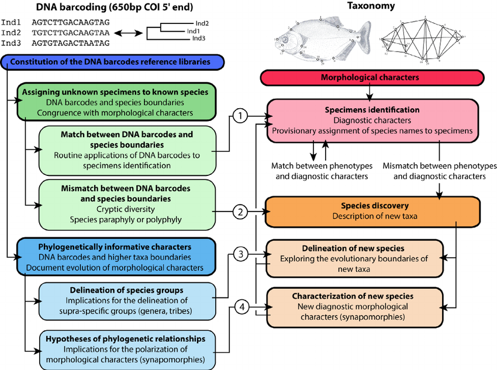
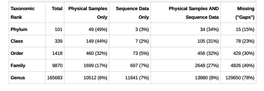
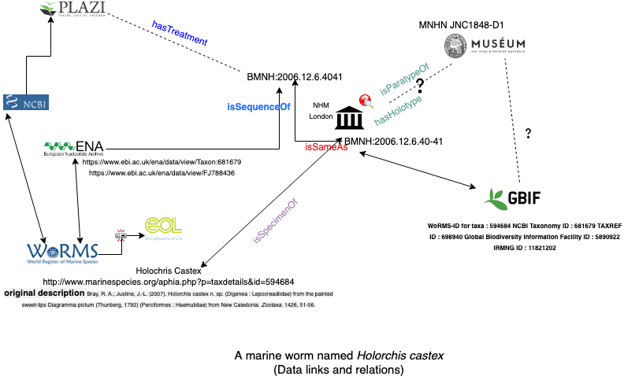

# DiSSCo-ELIXIR

This repository is for links and information to facilitate the upcoming workshop and further [DiSSCo](https://www.dissco.eu/)-[ELIXIR](https://elixir-europe.org/) initiatives. 


## First workshop 

Organised by [DiSSCo](https://www.dissco.eu/) and [ELIXIR](https://elixir-europe.org) and hosted by [CETAF](https://cetaf.org/). 

**Museum specimen <-> molecular data linkage: why and how?**


## Background and Context 


### What's in a name 

This example uses the [taxize R package](Using taxize R package).

```
> get_uid(c("Agathis Montana"))
More than one UID found for taxon 'Agathis+Montana'!

            Enter rownumber of taxon (other inputs will return 'NA'):

  status    rank              division                  scientificname
1 active species wasps, ants, and bees Agathis montana Shestakov, 1932
2 active species           seed plants   Agathis montana de Laub. 1969
  commonname    uid   genus                 species subsp modificationdate
1            144212 Agathis montana Shestakov, 1932       2018/11/09 00:00
2             60852 Agathis   montana de Laub. 1969       2018/11/09 00:00

```
Is it a plant or a wasp? 

[https://www.ebi.ac.uk/ena/data/view/Taxon:60852](https://www.ebi.ac.uk/ena/data/view/Taxon:60852)

>Agathis montana is a valid species name in both the botanical and zoological codes. In order to resolve this ambiguity, sequence entries from these two species will be annotated with the binomial name and the taxonomic authority, i.e.:/organism="Agathis montana de Laub. 1969" (for the conifer)/organism="Agathis montana Shest. 1932" (for the wasp)


Taxonomic research is still one of the most important aspects of species identification. Museum and herbarium specimens are important source for such identification process and also for individual level trait measurement through time. We now have billions of specimens available but not all of them are digitized. A vast amount of trait data are available but linking and integrating remain a [challenge](https://doi.org/10.1101/328302). 

Furthermore, taxonomic identificaiton is a slow process. On the other hand DNA sequencing (some methods can be expensive) is one of the fastest ways of gathering evidence for taxonomic decision -- for example incorporating DNA evidence into [taxonomic decisions](https://doi.org/10.13156/arac.2018.18.2.94) 
[via DNA barcodes](https://dx.doi.org/10.3897%2Fzookeys.757.24453). But this approach is also prone to errors -- several papers (for example ([here](https://doi.org/10.1007/s13225-019-00428-3) and [here](https://doi.org/10.1046/j.1469-8137.2003.00894.x)) highlighted errors in sequence based identification. Researchers are also looking into multiple sources: morphological, ecological and molecular and [integrated](https://www.ncbi.nlm.nih.gov/pmc/articles/PMC2657783/) approaches. 


In essence we are dealing with heterogeneous data sources, formats, different workflows, standards from different domains (for example "traditional" collection and taxonomy based workflow versus newer DNA sequencing methods). 



[Figure]([http://doi.org/10.1515/dna-2015-0006) by Hubert, Nicolas, and Robert Hanner.
	

This [2015 publication](https://doi.org/10.1093/nar/gku1127) highlights various aspect of data storage, workflow, institutional involvement and most importantly FAIR aspect of data life cycle. 


>GenBank is an archive of sequence data, particularly important for sequences associated with publications in the scientific literature. In this case the GenBank entries serve as supplementary material to the publication, and are ‘owned’ by the submitter/author. In this role, it is vital to preserve the original data so that the analysis from the paper can be evaluated and replicated. GenBank also serves as the general reference set of sequence data for current research in biology. There is a tension between these two goals. We try to keep sequences and metadata current, and archive versions of every update to the sequence entries to support the archival requirement. We update the taxonomy with respect to synonymy, but rely on the submitters for the correct original taxonomic identification of their specimens and for the appropriate annotation of their source material (in isolate, strain, culture-collection and specimen-voucher qualifiers). This means that there are misidentified sequences in GenBank, and entries with other annotation problems. It is important to have these corrected (or flagged as problematic) to support the reference database requirement. Third-party updates are passed along to the original submitters but are not implemented in GenBank without the submitters’ permission; entries with egregious errors may be suppressed or flagged as ‘unverified’. Sequence from type can help to alleviate these problems by providing a backbone of reliably identified sequence data. 

Is it then just about data linkage?  The above was published in 2015. Are some of these issues solved? A [recent publication](https://doi.org/10.3897/biss.3.37288) by Devine and Coddington indicates other gaps in the data landscape. 


>Taxonomic gap analysis results for all of life on Earth as of 06 March 2019. Total counts were derived from the Catalogue of Life (Roskov et al. 2019). Counts of physical samples were derived from the union of the GGBN Data Portal (GGBN 2011) and the Global Catalogue of Microorganisms (Wu et al. 2013). DNA barcode sequence data counts were downloaded from
GenBank (Clark et al. 2015). Percentages represent the percent of the total in that category.


It is also not just about finding the data. A [2019 assessment](https://doi.org/10.1371/journal.pone.0217084) of [BOLD](http://www.boldsystems.org/) and [GenBank](https://www.ncbi.nlm.nih.gov/genbank/) highlights issues of accuracy and reliability:

> To achieve this, 1) curated reference materials for plants, macro-fungi and insects were obtained from national collections, 2) relevant barcode sequences (rbcL, matK, trnH-psbA, ITS and COI) from these reference samples were generated and used for searching against both databases, and 3) optimal search parameters were determined that ensure the best match to the known species in either database. While GenBank outperformed BOLD for species-level identification of insect taxa (53% and 35%, respectively), both databases performed comparably for plants and macro-fungi (~81% and ~57%, respectively). Results illustrated that using a multi-locus barcode approach increased identification success. This study outlines the utility of the BLAST search tool in GenBank and the BOLD identification engine for taxonomic identifications and identifies some precautions needed when using public sequence repositories in applied scientific disciplines.
> 

# Themes
Above issues can be categorised in the following themes: 

 

1. Data sources and services 
2. Service interoperability  
3. Workflow (museums are used to collection based workflows which is very different than DNA barcoding based workflow. Some large museums do both)
4. Standards and best practices 
5. Use case / user stories 


## Data Landscape 

Buildig the [DiSSCo knowledge graph](https://alexhardisty.wordpress.com/2019/07/25/building-the-dissco-knowledge-graph/) (by Alex Hardisty)

The (digital) fate of a small marine worm (based on the above knowledge graph). 





## Service Landscape 

- GenBank the NCBI
- European Nucleotide Archive (ENA) 
- DNA Databank of Japan (DDBJ)
-  [International Nucleotide Sequence Database Collaboration](http://www.insdc.org/)
- [Biosamples](https://www.ebi.ac.uk/biosamples/)
- [Biobank catalog](https://www.bbmri.nl/node/23)
- [Europmc](http://europepmc.org/)
- [Identifiers.org](https://identifiers.org/)
- [Molecular data in GBIF](https://data-blog.gbif.org/post/gbif-molecular-data/)

[BioCollection database overivew](https://doi.org/10.1093/database/bay006)


>The individual biorepository pages in BioCollections can serve as a start site for users specifically interested in the breakdown of sequenced vouchers at a specific institution. For example, Smithsonian Institution, National Museum of Natural History shares specimens and DNA samples with collaborators worldwide. As a result, DNA sequence data is submitted to Genbank, ENA and DDBJ by a large number of submitters and are often not formatted correctly and therefore are not linked to BioCollections Database. USNM (National Museum, >29 000 total records) and US (National Herbarium, > 16 000 total records) notations represent a large number of sequence records and are part of an important collaborative effort.


## Example data integration service 

### Global Biotic Interactions (GloBI) and Entrez 

[Global Biotic Interactions](https://www.globalbioticinteractions.org/) (GloBI) provides open access to finding species interaction data (e.g., predator-prey, pollinator-plant, pathogen-host, parasite-host) by combining existing open datasets using open source software. And [Entrez](https://www.ncbi.nlm.nih.gov/search/) (from NCBI) is a molecular biology database system that provides integrated access to nucleotide and protein sequence data,

I am using two R packages here: [rglobi](https://cran.r-project.org/web/packages/rglobi/) and [rentrez](https://cran.r-project.org/web/packages/rentrez/) from CRAN. 

A simple example that shows how species interacts and then links various items in the NCBI database. I am interested in [Spirometra erinaceieuropaei]([https://en.wikipedia.org/wiki/Spirometra_erinaceieuropaei) which is a tape worm. 


```
library(rglobi)
sp <- get_interactions(taxon = "Spirometra erinaceieuropaei", interaction.type = "parasiteOf")

```

Looking at the data frame, I can see that there is a `target_taxon_name`. 

```
> str(sp)
'data.frame':	178 obs. of  13 variables:
 $ source_taxon_external_id  : chr  "EOL:4968441" "EOL:4968441" "EOL:4968441" "EOL:4968441" ...
 $ source_taxon_name         : chr  "Spirometra erinaceieuropaei" "Spirometra erinaceieuropaei" "Spirometra erinaceieuropaei" "Spirometra erinaceieuropaei" ...
 $ source_taxon_path         : chr  "Cellular organisms | Eukaryota | Opisthokonta | Metazoa | Eumetazoa | Bilateria | Platyhelminthes | Cestoda | E"| __truncated__ "Cellular organisms | Eukaryota | Opisthokonta | Metazoa | Eumetazoa | Bilateria | Platyhelminthes | Cestoda | E"| __truncated__ "Cellular organisms | Eukaryota | Opisthokonta | Metazoa | Eumetazoa | Bilateria | Platyhelminthes | Cestoda | E"| __truncated__ "Cellular organisms | Eukaryota | Opisthokonta | Metazoa | Eumetazoa | Bilateria | Platyhelminthes | Cestoda | E"| __truncated__ ...
 $ source_specimen_life_stage: logi  NA NA NA NA NA NA ...
 $ interaction_type          : chr  "parasiteOf" "parasiteOf" "parasiteOf" "parasiteOf" ...
 $ target_taxon_external_id  : chr  "no:match" "EOL:1178681" "EOL:311234" "EOL:331125" ...
 $ target_taxon_name         : chr  "DOG" "Erinaceus amurensis" "Litoria aurea" ...
 $ study_source_citation     : logi  NA NA NA NA NA NA ...
 
```
Using that I can find the target taxon name (first ten) 

```

sp$target_taxon_name[1:10]
 [1] "DOG"                      "Erinaceus amurensis"     
 [3] "Litoria aurea"            "Rana tigrina"            
 [5] "Rana cancrivora"          "Cyclops affinis"         
 [7] "Cyclops phaleratus"       "Mesocyclops aspericornis"
 [9] "Litoria caerulea"         "Mustela putorius" 
```

 Now using the rentrez API, I can go to NCBI. 

```
all_the_links <- entrez_link(dbfrom='taxonomy', id=99802, db='all')
```

And find all these links 

```
all_the_links$links$taxonomy_gene
 [1] "6446594" "6446593" "6446592" "6446591" "6446590" "6446589" "6446588"
 [8] "6446587" "6446586" "6446585" "6446584" "6446583" "6446582" "6446581"
[15] "6446580" "6446579" "6446578" "6446577" "6446576" "6446575" "6446574"
[22] "6446573" "6446572" "6446571" "6446570" "6446569" "6446568" "6446567"
[29] "6446566" "6446565" "6446564" "6446563" "6446562" "6446561" "6446560"
[36] "6446559"
```
And resolve it via [https://identifiers.org/ncbigene:6446593](https://identifiers.org/ncbigene:6446593).


   
### BioThingsAPI 

[Cross-linking BioThings APIs through JSON-LD to facilitate knowledge exploration](https://doi.org/10.1186/s12859-018-2041-5)

This API uses [Identifiers.org](Identifiers.org) service to cross link with JSON-LD Here's the [json context](http://myvariant.info/context/context.json). 

```
{
    "@context": {
        "cadd.gene.gene_id": "http://identifiers.org/ensembl.gene/",
        "cadd.gene.genename": "http://identifiers.org/hgnc.symbol/",
        "cadd.gene.ccds_id": "http://identifiers.org/ccds/",
        "clinvar.uniprot": "http://identifiers.org/uniprot/",
        "clinvar.rsid": "http://identifiers.org/dbsnp/",
        "clinvar.rcv.accession": "http://identifiers.org/clinvar/",
        "evs.gene.accession": "http://identifiers.org/refseq/",
        "grasp.rsid": "http://identifiers.org/dbsnp/",
        "grasp.publication.snpid": "http://identifiers.org/dbsnp/",
        "gwassnps.rsid": "http://identifiers.org/dbsnp/",
        "gwassnps.genename": "http://identifiers.org/hgnc.symbol/",
        "gwassnps.pubmed": "http://identifiers.org/pubmed/",
        "mutdb.rsid": "http://identifiers.org/dbsnp/",
        "snpeff.lof.genename": "http://identifiers.org/hgnc.symbol/",
        "snpeff.ann.genename": "http://identifiers.org/hgnc.symbol/",
        "snpeff.nmd.genename": "http://identifiers.org/hgnc.symbol/"
    }
}
```
Steps: 

Input: 

1. Variant HGVS ID (e.g. chr6:g.26093141G>A)
2. Retrieve Entrez Gene ID(s) set1g related to HGVS ID(s)
3. Retrieve Wikipathways ID(s) set1p in which Entrez Gene ID(s) set1g are involved
4. Retrieve Other Entrez Gene ID(s) set2g which are included in Wikipathways ID(s) set1p
5. Retrieve Uniprot ID(s) set2u which correspond to Entrez Gene ID(s) set2g
Retrieve Drug Inchi Key(s) set1d which target Uniprot ID(s) set2u

Output: Available drugs targetting genes/pathways related to the input HGVS ID

>For example, a user who would like to fetch the linked OMIM [15] disease IDs for a specific variant in MyVariant.info must first consult the JSON data schema, which would define the JSON field path of the OMIM ID (“clinvar.rcv.conditions.identifiers.omim”). Moreover, as services evolve, API developers often introduce incompatible changes in data structure between different versions, which would require API users to update their client code in order to properly handle the new JSON schema.
...


# Standards 

1. Darwin Core 
2. [The Trouble with Triplets in Biodiversity Informatics: A Data-Driven Case against Current Identifier Practices, 2014](https://www.ncbi.nlm.nih.gov/pmc/articles/PMC4254916/)
3. [GGBN Data Standard](https://wiki.ggbn.org/ggbn/GGBN_Data_Standard) 
3. [Bioschema](https://bioschemas.org/) 
4. [MOD-CO](https://doi.org/10.1093/database/baz002)

>With the advent of advanced molecular meta-omics techniques and methods, a new era commenced for analysing and characterizing historic collection specimens, as well as recently collected environmental samples. Nucleic acid and protein sequencing-based analyses are increasingly applied to determine the origin, identity and traits of environmental (biological) objects and organisms. In this context, the need for new data structures is evident and former approaches for data processing need to be expanded according to the new meta-omics techniques and operational standards. Existing schemas and community standards in the biodiversity and molecular domain concentrate on terms important for data exchange and publication. Detailed operational aspects of origin and laboratory as well as object and data management issues are frequently neglected. Meta-omics Data and Collection Objects (MOD-CO) has therefore been set up as a new schema for meta-omics research, with a hierarchical organization of the concepts describing collection samples, as well as products and data objects being generated during operational workflows. 


# Workflow 
- From field collection event to specimen accession to long term storage 
- Institution (museum collection managers) specific workflow. 
- When does the life of a specimen begin? Always at the point of formal 
accession to one of the collections? When it becomes trackable via an internal-persistent-identifer? 
- Usually specimens are not collected with the primary intent of DNA analysis
 

[Species delimitation in the morphologically conserved Coecobrya (Collembola: Entomobryidae): A case study integrating morphology and molecular traits to advance current taxonomy](https://onlinelibrary.wiley.com/doi/full/10.1111/zsc.12279) - has a good example of workflow 

>For Collembola, morphological and molecular characters are the most frequently used; other types of data, such as ecology, reproductive compatibility, behaviour, cytogenetics, cuticular compounds, enzymes, whole genome scans, can provide complementary evidence. Multiple types of data can be reconciled under the unified species concept GLC (de Queiroz, 2007). The operational workflow for Collembola can be modified from Yeates et al.'s “iterative taxonomy” (2011), continuously testing species hypotheses with new sources of data
>
- [EBI submission guideline for taxon name](https://www.ebi.ac.uk/ena/submit/taxonomy)

# Use Cases / User stories 

- We need user stories to understand the requirements. 
- We identified 15 [user stories](https://github.com/DiSSCo/dissco-elixir/issues) from a previous [ICEDIG](https://www.icedig.eu/) survey. 

# Recent Papers 

- [Review and Interpretation of Trends in DNA Barcoding](https://www.frontiersin.org/articles/10.3389/fevo.2019.00302/full), September, 2019
>Interpretations and analytical practices surrounding DNA barcoding are examined using a compilation of 3,756 papers (as of December 31, 2018) with “DNA Barcode” in the abstract published since 2004. By examining the rise of DNA barcoding in natural history and biodiversity science over this period, we hope to detect the extent to which its purposes, premises, rationale and application have evolved. 
>

- [Parasites Lost: using natural history collections to track disease change across deep time](https://doi.org/10.1002/fee.2017), March, 2019


>"Specimens held in natural history collections represent a chronological archive of life on Earth and may, in many cases, be the only available source of data on historical disease patterns. It is possible to extract information on past disease rates by studying trace fossils (indirect fossilized evidence of an organism's presence or activity, including coprolites or feces), sequencing ancient DNA of parasites, and examining sediment samples, mummified remains, study skins (preserved animal skins prepared by taxidermy for research purposes), liquid‐preserved hosts, and hosts preserved in amber. Such use of natural history collections could expand scientific understanding of parasite responses to environmental change across deep time (that is, over the past several centuries), facilitating the development of baselines for managing contemporary wildlife disease."
>

- [FuzzyID2: A software package for large data set species identification via barcoding and metabarcoding using hidden Markov models and fuzzy set methods](https://doi.org/10.1111/1755-0998.12738)

- [Entomological Collections in the Age of Big Data](https://www.annualreviews.org/doi/full/10.1146/annurev-ento-031616-035536)


- [A DNA barcode library for 5,200 German flies and midges (Insecta: Diptera) and its implications for metabarcoding‐based biomonitoring](https://onlinelibrary.wiley.com/doi/full/10.1111/1755-0998.13022)

> This study summarizes results of a DNA barcoding campaign on German Diptera, involving analysis of 45,040 specimens. The resultant DNA barcode library includes records for 2,453 named species comprising a total of 5,200 barcode index numbers (BINs), including 2,700 COI haplotype clusters without species‐level assignment, so called “dark taxa.” 
...
The present study has three main goals: (a) to provide a DNA barcode library for 5,200 BINs of Diptera; (b) to demonstrate, based on the example of bulk extractions from a Malaise trap experiment, that DNA barcode clusters, labelled with globally unique identifiers (such as OTUs and/or BINs), provide a pragmatic, accurate solution to the “taxonomic impediment”; and (c) to demonstrate that interim names based on BINs and OTUs obtained through metabarcoding provide an effective method for studies on species‐rich groups that are usually neglected in biodiversity research projects because of their unresolved taxonomy.


- [Using taxonomic consistency with semi‐automated data pre‐processing for high quality DNA barcodes](https://besjournals.onlinelibrary.wiley.com/doi/full/10.1111/2041-210X.12824)

- [Collections-based research in the genomic era](https://doi.org/10.1111/bij.12721)

- [Embracing heterogeneity: coalescing the Tree of Life and the future of phylogenomics](https://www.ncbi.nlm.nih.gov/pubmed/30783571)